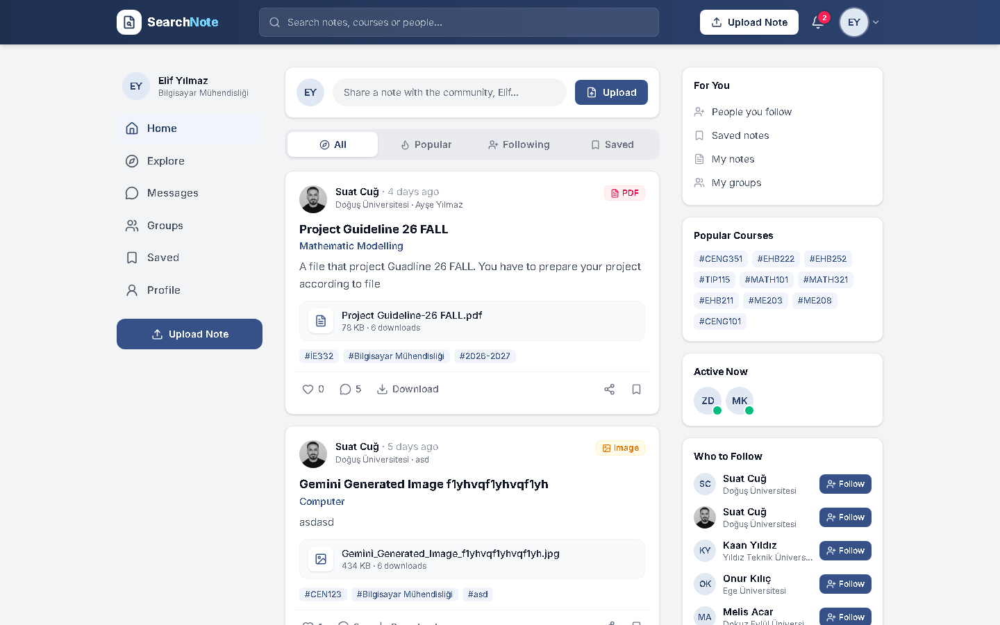
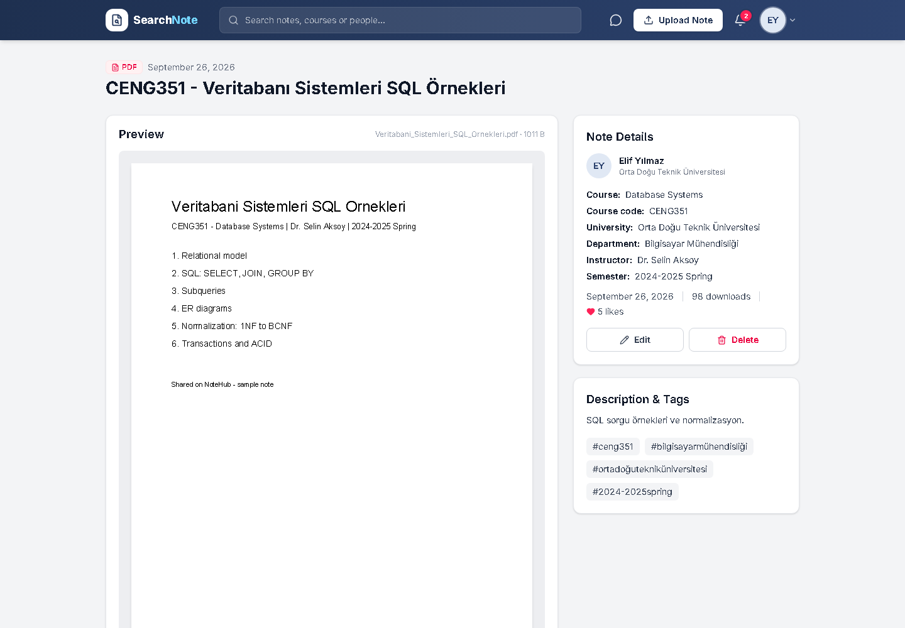
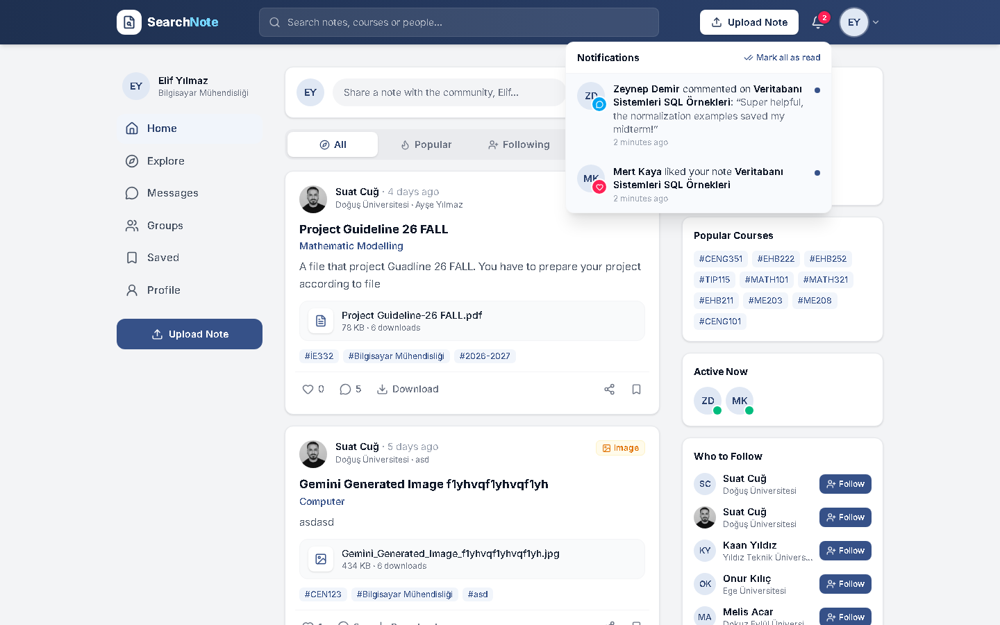
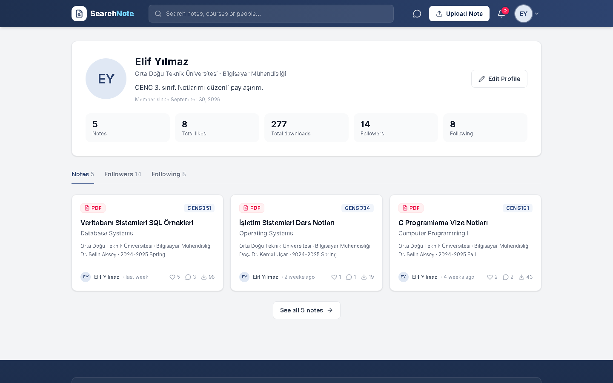
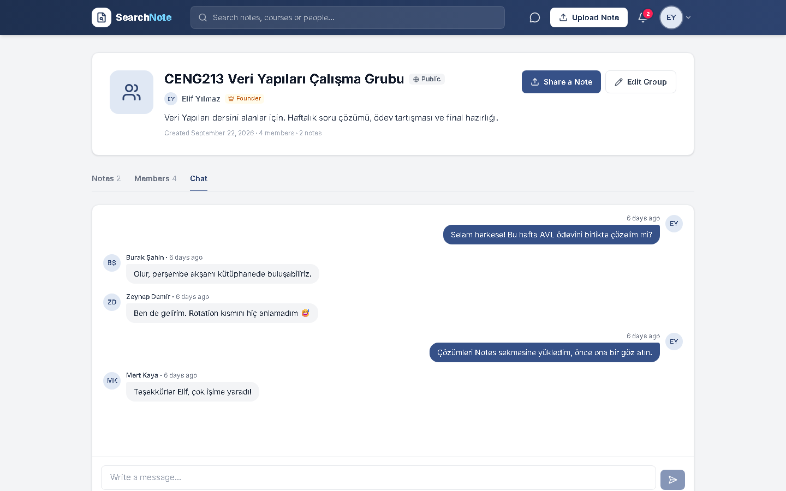
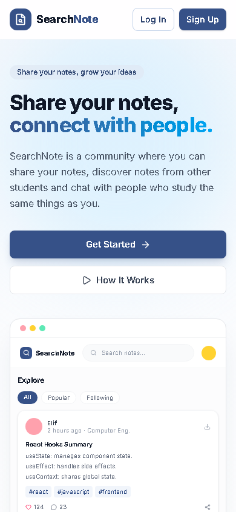
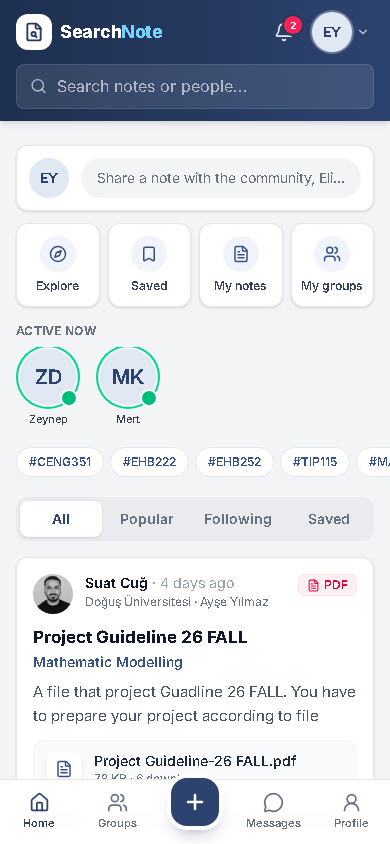

<div align="center">

# SearchNote 📚

**Üniversite öğrencilerinin ders notlarını paylaştığı, başkalarının notlarını
keşfettiği ve aynı dersleri çalışan insanlarla bağ kurduğu; sosyal akış, bildirimler,
birebir mesajlaşma ve çalışma gruplarıyla birlikte gelen bir not paylaşım platformu.**

[Özellikler](#-özellikler) · [Ekran görüntüleri](#-ekran-görüntüleri) · [Teknolojiler](#-kullanılan-teknolojiler) · [Kurulum](#-yerelde-çalıştırma) · [Deploy](#️-deploy)


🔗 **Canlı demo:** [searchnote.netlify.app](https://searchnote.netlify.app/)

</div>

---

## Proje hakkında

SearchNote, sınav dönemlerinde herkesin aynı özetleri tekrar tekrar yazmasının ve aynı
çıkmış soruları aramasının önüne geçmek için tasarlandı. Bir öğrencinin hazırladığı iyi
bir not, aynı dersi alan herkesin işine yarasın diye platform üç fikir üzerine kurulu:

- **📤 Paylaş** – PDF, Word, görsel veya arşiv olarak notunu yükle; üniversite, bölüm,
  ders kodu, hoca ve dönem bilgileriyle etiketle. Kredi ya da puan sistemi yok, indirme
  sınırsız ve ücretsiz.
- **🔎 Keşfet** – Sosyal medya düzenindeki akışta yeni ve popüler notları gör; ders,
  hoca, üniversite ya da yazar adıyla ara, filtrele, beğendiklerini kaydet.
- **🤝 Bağ kur** – Notların yazarlarını takip et, yorum yap, birebir mesajlaş, aynı
  dersi alanlarla çalışma grubu kur ve grup sohbetinde buluş.

Giriş yapmamış ziyaretçi bir tanıtım (landing) sayfası görür; not kataloğu ve arama
yalnızca üyelere açıktır. Paylaşılan tek bir not, profil ya da grup bağlantısı ise
ziyaretçiye de açılır, böylece paylaşılan linkler kırılmaz.

> **Not:** Bu depo, çalışması için gerçek bir backend'e ihtiyaç duyar. Sahte/mock API
> katmanı yoktur; frontend, `VITE_API_URL` üzerinden Express + MongoDB API'sine bağlanır.
> Kurulum için [Yerelde çalıştırma](#-yerelde-çalıştırma) bölümüne bakın.

## ✨ Özellikler

**Not paylaşımı**
- PDF, DOCX, JPG/PNG ve ZIP/RAR yükleme (varsayılan en fazla 25 MB)
- Dosya içeriğinin imzasıyla uzantının karşılaştırılması — uzantısı değiştirilmiş dosyalar reddedilir
- PDF ve görseller için sayfa içi önizleme (pdf.js); önizleme indirme sayacını artırmaz
- Not düzenleme/silme, notu isteğe bağlı olarak bir çalışma grubuna (yalnız üyelere açık) paylaşma

**Sosyal akış**
- Sol menü · ortada akış · sağda öneriler şeklinde üç sütunlu ana sayfa
- **All / Popular / Following / Saved** sekmeleri ve "Load more" ile sayfalama
- Gönderi kartlarında beğenme, yorum, indirme, paylaşma (bağlantı kopyalama / Web Share API) ve kaydetme;
  beğeni ve kaydetme iyimser (optimistic) güncellenir
- **Popular Courses:** not sayısı ve beğeniye göre öne çıkan dersler
- **Active Now:** karşılıklı takipleşilen kişilerden son 15 dakikada aktif olanlar
- **Who to Follow:** aynı üniversite/bölümdekiler öncelikli takip önerileri

**🔔 Bildirimler**
- Beğeni, yorum, yeni takipçi, gruba katılım, özel gruba katılma isteği ve isteğin onaylanması
- Okunmamış sayısı rozeti, "Mark all as read", tıklayınca ilgili not / profil / grup sekmesine gitme
- Tekrarlanan olaylar tek bildirimde birleşir; geri alınan eylemin (beğeniyi kaldırma, takibi bırakma,
  yorumu silme) bildirimi de silinir
- Bildirimler 90 gün sonra MongoDB TTL index'iyle otomatik temizlenir

**💬 Mesajlaşma & etkileşim**
- Beğeni, yorum ve takip sistemi; profillerde not, beğeni, indirme ve takipçi istatistikleri
- Birebir mesajlaşma, okunmamış mesaj rozeti, not sayfasından "Ask the author"
- Kullanıcı engelleme (engellenen kişi mesaj atamaz, takip edemez, aramada çıkmaz)

**👥 Çalışma grupları**
- Herkese açık gruplar ve kurucu onaylı özel gruplar
- Kurucu yetkileri: düzenleme, silme, üye çıkarma, kuruculuğu devretme, katılma isteklerini yönetme
- Grup sohbeti ve yalnızca üyelere görünen grup notları

**🔎 Arama & keşif**
- Kelime bazlı arama: başlık, ders adı/kodu, hoca, üniversite, bölüm ve **yazar adında** arar
- Aynı aramada eşleşen kişilerin de listelenmesi
- Üniversite, bölüm, dönem, dosya türü filtreleri ve en yeni / en çok beğenilen / en çok indirilen sıralaması

**📱 Mobil deneyim**
- Telefonda alt sekme çubuğu ve ortada "+" yükleme butonu
- Akışın üstünde kısayol kartları (Explore, Saved, My notes, My groups), hikâye tarzı "Active now" şeridi,
  yatay kaydırmalı popüler ders etiketleri ve akış arasında takip önerisi kartları

**Altyapı**
- JWT tabanlı kimlik doğrulama, `bcryptjs` ile şifre hash'leme
- `express-validator` ile istek doğrulama, `helmet` + `cors` + `morgan` katmanları, mesajlarda hız sınırı
- Not kataloğu ve kişi araması API düzeyinde üyelere kısıtlı
- Dosyalar Cloudinary'de (not dosyaları imzalı / yetkili erişimle) ya da yapılandırılmamışsa yerel diskte
- İsteğe bağlı `.edu.tr` e-posta şartı ve e-posta doğrulaması (özellik anahtarlarıyla açılıp kapatılır)
- `npm run seed` ile demo kullanıcı, not, grup ve sohbet verisinin yüklenmesi

## 📸 Ekran görüntüleri

| | |
|---|---|
| **Tanıtım sayfası (ziyaretçi)** <br>  | **Sosyal akış** <br>  |
| **Not detayı — PDF önizleme** <br>  | **Bildirimler** <br>  |
| **Profil** <br>  | **Çalışma grubu — sohbet** <br>  |
| **Mobil — tanıtım sayfası** <br>  | **Mobil — akış** <br>  |

## 🛠 Kullanılan teknolojiler

| | |
|---|---|
| **Frontend** | React 19, Vite 8, Redux Toolkit + RTK Query, React Router 7, Tailwind CSS 4, lucide-react, pdf.js (pdfjs-dist), oxlint |
| **Backend** | Node.js, Express 5, MongoDB + Mongoose, JWT (jsonwebtoken), bcryptjs, express-validator, Multer, helmet, morgan, cors, Nodemailer, dotenv |
| **Depolama** | Cloudinary (yapılandırılmamışsa `backend/uploads` yerel disk) |
| **Deploy** | Netlify (frontend) · Render (backend) · MongoDB Atlas (veritabanı) |

## 📁 Proje yapısı

```
proje4/
├── backend/                 # Express 5 API
│   ├── config/              # MongoDB bağlantısı, özellik anahtarları (features.js)
│   ├── controllers/         # auth, note, comment, user, group, message, notification, stats, contact
│   ├── middlewares/         # auth, verified, validate, upload (multer), rateLimit, error
│   ├── models/              # User, Note, Group, GroupMessage, Conversation, DirectMessage,
│   │                        # Notification, ContactMessage (Mongoose)
│   ├── routes/              # /api/* uç tanımları
│   ├── services/            # storage (Cloudinary/disk), notification, note, group, block, mail
│   ├── scripts/             # seed.js (demo veri), migrateToCloudinary.js
│   ├── validations/         # express-validator kural setleri
│   ├── utils/               # jwt, pagination, regex (kelime bazlı arama), dosya imzası kontrolü
│   ├── uploads/             # yerel dosya deposu (Cloudinary kapalıyken)
│   └── index.js             # sunucu girişi
├── frontend/                # React (Vite) istemcisi
│   ├── public/              # favicon, _redirects (Netlify SPA yönlendirmesi)
│   └── src/
│       ├── app/             # Redux store + authSlice
│       ├── components/
│       │   ├── feed/        # SocialHome, NotePostCard, FeedSidebar, FeedRightRail, mobil ekler
│       │   ├── layout/      # Navbar, GuestNavbar, NotificationBell, Footer, MobileTabBar ...
│       │   ├── notes/       # BrowseNotes, NoteCard, CommentSection, FilterBar, PdfPages ...
│       │   ├── groups/      # grup kartları, sohbet, üye ve istek listeleri
│       │   ├── messages/    # konuşma listesi ve sohbet paneli
│       │   └── users/       # avatar, takip/engelle butonları, kişi sonuçları
│       ├── pages/           # LandingPage, HomePage, NoteDetail, Profile, Groups, Messages,
│       │                    # Upload/Edit, About, Help, Contact, Legal ...
│       ├── services/        # RTK Query API dilimleri (auth, notes, users, groups, messages,
│       │                    # notifications, stats, contact)
│       └── lib/             # sabitler, biçimlendirme, indirme yardımcıları
└── docs/screenshots/        # README ekran görüntüleri
```

## 🚀 Yerelde çalıştırma

Gerekli: **Node.js 20+** ve bir **MongoDB** veritabanı
([MongoDB Atlas](https://www.mongodb.com/atlas) ücretsiz planı ya da yerel `mongod`).
Cloudinary ve SMTP isteğe bağlıdır.

```bash
# 1) Backend
cd backend
npm install
cp .env.example .env        # değerleri kendi bilgilerinle doldur (aşağıya bak)
npm run seed                # (isteğe bağlı) demo kullanıcı/not/grup verisini yükle
npm run dev                 # http://localhost:5000

# 2) Frontend (yeni terminal)
cd frontend
npm install
cp .env.example .env        # VITE_API_URL=http://localhost:5000/api
npm run dev                 # http://localhost:5173
```

> Windows'ta `cp` yerine `copy` kullanabilirsiniz. Demo hesapların e-posta ve şifreleri
> `backend/scripts/seed.js` içinde tanımlıdır.

### Ortam değişkenleri

**`backend/.env`**

| Değişken | Açıklama |
|---|---|
| `PORT` | API portu (varsayılan `5000`) |
| `NODE_ENV` | `development` / `production` |
| `MONGO_URI` | MongoDB bağlantı dizesi |
| `JWT_SECRET` | JWT imzalama anahtarı (zorunlu, uzun ve rastgele) |
| `JWT_EXPIRES_IN` | Token ömrü (örn. `7d`) |
| `CLIENT_URL` | İzin verilen frontend origin(leri); birden fazlaysa virgülle ayır. İlki doğrulama e-postasındaki bağlantı için de kullanılır |
| `REQUIRE_EDU_EMAIL` | `true` ise yalnızca `.edu.tr` e-postalarla kayıt |
| `REQUIRE_EMAIL_VERIFICATION` | `true` ise e-posta doğrulanmadan yükleme / indirme / etkileşim yapılamaz |
| `MAX_FILE_SIZE_MB` | En büyük dosya boyutu (varsayılan `25`) |
| `SMTP_HOST` · `SMTP_PORT` · `SMTP_USER` · `SMTP_PASS` · `MAIL_FROM` | Doğrulama e-postaları için SMTP; boşsa bağlantı konsola yazılır |
| `CLOUDINARY_URL` | `cloudinary://<api_key>:<api_secret>@<cloud_name>`; boşsa dosyalar yerel diske kaydedilir |

**`frontend/.env`**

| Değişken | Açıklama |
|---|---|
| `VITE_API_URL` | Backend API kök adresi (örn. `http://localhost:5000/api`) |
| `VITE_REQUIRE_EDU_EMAIL` | Backend'deki `REQUIRE_EDU_EMAIL` ile aynı tutulmalı |

### Faydalı komutlar

| Konum | Komut | İş |
|---|---|---|
| backend | `npm run dev` | Nodemon ile API |
| backend | `npm start` | Prod modda API |
| backend | `npm run seed` | Veritabanına demo kullanıcı, not, grup ve sohbet verisi yükle |
| backend | `npm run seed:clear` | Demo veriyi sil |
| backend | `npm run migrate:cloudinary` | Yerel diskteki dosyaları Cloudinary'ye taşı |
| frontend | `npm run dev` | Vite geliştirme sunucusu |
| frontend | `npm run build` | Üretim derlemesi (`dist/`) |
| frontend | `npm run preview` | Derlemeyi yerelde önizle |
| frontend | `npm run lint` | oxlint |

## 🌐 API uçları (özet)

Tüm uçlar `/api` önekiyle sunulur. `🔒` kimlik doğrulama (`Authorization: Bearer <token>`),
`✅` ayrıca doğrulanmış hesap gerektirir (`REQUIRE_EMAIL_VERIFICATION` açıksa).

| Yöntem | Uç | Açıklama |
|---|---|---|
| `POST` | `/auth/register` · `/auth/login` | Kayıt / giriş |
| `GET` | `/auth/me` 🔒 | Oturumdaki kullanıcı |
| `POST` | `/auth/verify-email` · `/auth/resend-verification` 🔒 | E-posta doğrulama |
| `GET` | `/notes` 🔒 | Not arama ve filtreleme (`q`, `university`, `department`, `courseCode`, `sort` ...) |
| `GET` | `/notes/feed` · `/notes/saved` 🔒 | Takip edilenlerin notları / kaydedilen notlar |
| `GET` | `/notes/filters` · `/notes/trending-courses` 🔒 | Filtre seçenekleri / popüler dersler |
| `GET` | `/notes/:id` | Not detayı (paylaşılan bağlantılar için herkese açık) |
| `POST` · `PATCH` · `DELETE` | `/notes` · `/notes/:id` 🔒✅ | Not yükleme (multipart, alan: `file`) / düzenleme / silme |
| `GET` | `/notes/:id/preview` · `/notes/:id/download` 🔒✅ | Önizleme / indirme |
| `POST` · `DELETE` | `/notes/:id/like` 🔒✅ · `/notes/:id/save` 🔒 | Beğeni / kaydetme |
| `POST` · `DELETE` | `/notes/:id/comments` 🔒✅ · `/notes/:id/comments/:commentId` 🔒 | Yorum ekleme / silme |
| `GET` | `/users/search` · `/users/active` · `/users/suggestions` 🔒 | Kişi arama / aktif takipleşilenler / takip önerileri |
| `GET` | `/users/:id` · `/users/:id/notes` · `/users/:id/followers` · `/users/:id/following` | Profil ve listeleri |
| `PATCH` · `PUT` | `/users/me` · `/users/me/avatar` · `/users/me/password` 🔒 | Profil, avatar, şifre güncelleme |
| `POST` · `DELETE` | `/users/:id/follow` 🔒✅ · `/users/:id/block` 🔒 | Takip / engelleme |
| `GET` · `POST` | `/groups` · `/groups/mine` | Grup arama / gruplarım / grup oluşturma |
| `GET` · `PATCH` · `DELETE` | `/groups/:id` | Grup detayı / düzenleme / silme (kurucu) |
| `POST` · `DELETE` | `/groups/:id/join` 🔒 | Katılma (özel grupta istek) / ayrılma |
| `GET` · `POST` · `DELETE` | `/groups/:id/requests/:userId` 🔒 | Katılma isteklerini listeleme / onaylama / reddetme (kurucu) |
| `DELETE` · `POST` | `/groups/:id/members/:userId` · `/groups/:id/owner/:userId` 🔒 | Üye çıkarma / kuruculuğu devretme |
| `GET` · `POST` | `/groups/:id/notes` · `/groups/:id/messages` 🔒 | Grup notları / grup sohbeti |
| `GET` · `POST` | `/messages/conversations` 🔒 | Konuşmalar / yeni konuşma başlatma |
| `GET` · `POST` · `DELETE` | `/messages/conversations/:id` · `/messages/conversations/:id/messages` 🔒 | Konuşma, mesaj gönderme ve silme |
| `GET` | `/messages/unread-count` 🔒 | Okunmamış mesaj sayısı |
| `GET` | `/notifications` · `/notifications/unread-count` 🔒 | Bildirimler / okunmamış sayısı |
| `POST` · `PATCH` | `/notifications/read-all` · `/notifications/:id/read` 🔒 | Okundu işaretleme |
| `GET` | `/stats` | Herkese açık topluluk sayaçları (tanıtım sayfası) |
| `POST` | `/contact` | İletişim formu |

**Gerçek zamanlılık:** Mesajlaşma (5 sn), konuşma listesi (10 sn), grup sohbeti (5 sn),
okunmamış rozetleri ve bildirimler (30 sn) ile aktif kullanıcılar (60 sn), WebSocket yerine
periyodik sorgulama (polling) ile güncellenir; sekme arka plandayken sorgulama durur.

## ☁️ Deploy

**Frontend → Netlify**
- Site oluştururken *Base directory* = `frontend`, *Build command* = `npm run build`, *Publish directory* = `frontend/dist`.
- SPA yönlendirmesi `frontend/public/_redirects` dosyasındaki `/* /index.html 200` kuralıyla sağlanır
  (doğrudan `/notes/...` gibi bir path'e gidince 404 olmaması için).
- Ortam değişkenleri: `VITE_API_URL` = yayınlanan backend'in `/api` adresi, `VITE_REQUIRE_EDU_EMAIL`.
- `main` branch'e her push'ta Netlify otomatik yeniden build alır.

**Backend → Render (veya Railway, Fly.io vb.)**
- *Root directory* = `backend`, *Build command* = `npm install`, *Start command* = `npm start`.
- Ortam değişkenleri: `MONGO_URI` (MongoDB Atlas), `JWT_SECRET`, `JWT_EXPIRES_IN`, `CLIENT_URL`,
  `CLOUDINARY_URL`, `NODE_ENV=production` ve gerekirse SMTP ayarları.
- `CLIENT_URL`, Netlify adresiyle **birebir** aynı olmalı (örn. `https://searchnote.netlify.app`, sonda `/` olmadan);
  aksi halde CORS hatası alınır. Sunucu açılışta izin verilen origin'leri loglar.
- Render'ın ücretsiz planında servis bir süre istek almazsa uyur; ilk istek 30–60 saniye sürebilir.
- Sunucusuz/çok örnekli ortamlarda dosya deposu olarak Cloudinary kullanılmalı (yerel disk kalıcı değildir);
  mesaj hız sınırı bellekte tutulduğu için birden fazla örnekte Redis gibi paylaşımlı bir depo gerekir.

## 📄 Lisans

MIT — kök dizine bir `LICENSE` dosyası ekleyerek resmileştirebilirsiniz.
